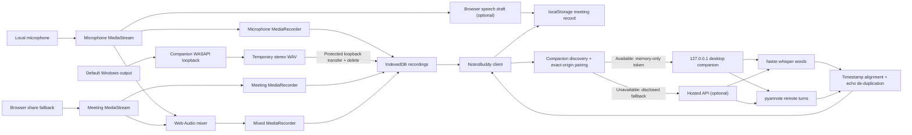
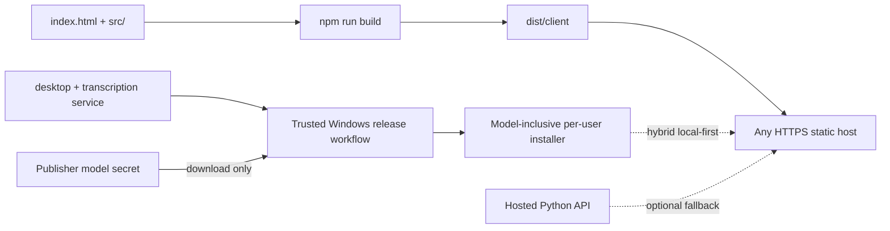

# Architecture

NotesBuddy consists of a dependency-free static browser client and a Python
service that can run as a paired Windows companion or a hosted anonymous API.
The client owns microphone/browser-fallback capture, browser storage, playback,
and UI. The companion owns Windows-output capture plus local speech-to-text and
speaker diarization.

## Design goals

- Keep original recordings and meeting records local by default.
- Capture local and remote audio as separate synchronized sources.
- Never fabricate transcript or summary text.
- Make unsupported capabilities and failed permissions explicit.
- Keep controls stable during recording and playback.
- Preserve legacy single-recording meetings.
- Avoid placing model credentials in the static client.
- Keep local pairing and hosted access behind one browser job contract.
- Give hosted prototype jobs short-lived ownership and bounded compute.

## Runtime overview



## Browser components

### `index.html`

Direct-launch entry point. It loads `src/runtime-config.js`, then
`src/meeting-audio.js`, then `src/app.js` using relative paths, so both HTTP and
`file://` launch paths work.

### `src/runtime-config.js`

Contains public, non-secret deployment configuration: local/hosted/hybrid mode,
the loopback endpoint, hosted fallback, and companion download URL. Credentials
must never be placed in this file.

### `src/meeting-audio.js`

Framework-independent browser module containing:

- recording-asset migration and source selection;
- speaker normalization and labels;
- transcript result normalization;
- cross-source echo de-duplication;
- speaker rename propagation;
- extractive brief generation;
- companion discovery, automatic pairing, and health verification;
- local-pairing and hosted anonymous-session API client.

The module uses a classic global (`NotesBuddyMeetingAudio`) so direct local-file
launch does not depend on ES module CORS behavior. Its pure functions are tested
under Node.

### `src/app.js`

Owns:

- application, settings, profile, and capture state;
- template rendering and event delegation;
- microphone, companion-loopback, and display-fallback permission flow;
- coordinated browser `MediaRecorder` instances plus companion WAV transfer;
- optional browser speech-recognition draft;
- IndexedDB storage and `localStorage` metadata;
- audio hydration, playback, seeking, source download;
- transcription job lifecycle and cancellation;
- speaker roster, rename UI, search, copy, export, notes, and actions.

Timer, live transcript, source-status, and interrupted-share warning updates
modify narrow DOM regions. This avoids replacing recording controls every
second. Full rendering preserves the current audio asset and position when
possible.

### `src/styles.css`

Defines design tokens, responsive layouts, recording/source states, speaker and
transcription panels, reduced-motion behavior, mobile navigation, and the 320 px
minimum supported layout.

### `server.mjs`

Dependency-free development server bound to `127.0.0.1:4173`. It applies
no-cache headers and an `index.html` fallback.

### `build.mjs`

Recreates `dist/`, including `meeting-audio.js`, and copies the static client
plus the existing worker/hosting metadata. Generated client assets are tracked
and validated against source by `npm test`.

## Capture lifecycle

1. Confirm at least one source is selected.
2. If compatible companion capability `systemAudioCapture` is connected,
   request microphone permission first, then start a protected stereo 48 kHz
   WASAPI loopback capture of the default Windows output.
3. Otherwise, call `getDisplayMedia()` immediately from the start-button
   activation and request the microphone second. Verify the share contains an
   audio track; its video track remains alive but is never recorded or stored.
4. Create isolated microphone and meeting streams. Browser fallback also builds
   a mixed Web Audio stream; companion capture preserves separate microphone
   and Windows-output tracks.
5. Start browser recorders together and collect chunks every 500 ms. Poll the
   companion for real output-signal status.
6. Pause/resume browser recorders, mixer, and companion capture together.
7. On finish, stop browser recorders and download the companion WAV before
   stopping local tracks. The companion deletes its temporary file after the
   response.
8. Persist each non-empty Blob independently, prefer Windows output for playback
   when no mixed track exists, then store the meeting/source metadata.

If companion or display capture fails, microphone capture continues.
If the user ends sharing during a meeting, the UI marks the meeting source
ended, inserts a persistent warning, and keeps the microphone path active.

## Persistence

### `localStorage`

| Key | Contents |
| --- | --- |
| `notesbuddy-profile` | Local profile ID, name, initials, timestamps |
| `notesbuddy-meetings` | Meetings, asset metadata, speakers, transcript, notes, actions |
| `notesbuddy-settings` | Capture defaults, deployment-safe service settings, processing preferences |

Hybrid automatic tokens are never stored. They remain in the current page's
memory and are revoked on reload, expiry, or companion restart. Explicit manual
CLI mode can still store a recovery token in browser settings.

### IndexedDB

- Database: `notesbuddy-audio`
- Version: `1`
- Object store: `recordings`
- New asset keys:
  - `<meeting-id>:microphone`
  - `<meeting-id>:meeting`
  - `<meeting-id>:mixed`

New meetings retain `audioId` pointing to their preferred playback asset for
compatibility. `recordingAssets` is authoritative. Legacy meetings containing
only `audioId` are exposed as a virtual mixed asset without rewriting the Blob.
Deletion enumerates and removes every unique asset ID.

Profile, meeting, import, transcript, and job identifiers use UUIDs. A profile
ID is not authentication or a server session.

## Transcription service

The shared engine and API live under `services/transcription/`.

### Security boundary

- Launcher binds Uvicorn to `127.0.0.1`.
- CORS allows only configured origins.
- Modern private-network preflight is supported for trusted origins.
- Discovery returns only non-secret compatibility metadata.
- The desktop launcher issues origin-bound, expiring, in-memory browser tokens
  only after exact-origin validation.
- Missing, `null`, and unknown origins cannot pair automatically.
- Protected endpoints require `X-NotesBuddy-Pairing-Token`.
- A persistent 256-bit manual recovery token remains under the OS user profile.
- Uvicorn access logs are disabled by the launcher.
- Normal API responses/logs do not include transcript content or audio paths
  except the transcript returned to the paired requesting client.

### Job lifecycle

1. Validate token, metadata, source presence, and per-source size.
2. Stream multipart uploads into a random OS temporary directory.
3. Queue the job in a bounded executor (one worker by default).
4. Lazily load model adapters.
5. Transcribe the microphone track and assign every word to `local-user`.
6. Transcribe the meeting track. For mixed-only imports, use mixed as the
   remote source; a mic-only mixed duplicate is intentionally skipped.
7. Diarize remote audio and prefer exclusive speaker intervals when available.
8. Map model labels to `remote-1`, `remote-2`, and so on in first-appearance
   order.
9. Assign words to intervals by greatest overlap. Only a 350 ms rounding
   tolerance is permitted; otherwise use `remote-unknown`.
10. Collapse adjacent words, merge source segments by shared timestamps, and
    remove near-identical overlapping cross-source echo.
11. Return JSON and remove the temporary job directory in `finally`.

Cancellation sets a cooperative event. Native model work may finish its current
operation before observing it, but terminal cleanup always runs.

### Hosted anonymous boundary

`NOTESBUDDY_ACCESS_MODE=anonymous` changes authentication without changing the
job/model contract:

1. `POST /v1/sessions` issues a random expiring browser-session token.
2. Only its SHA-256 digest is kept by the service.
3. Job creation reserves bounded compute for that session.
4. Every read/cancel request must present the owning session token.
5. Requests for another session's job return `404`.
6. Session creation is rate-limited by a hashed client network key.

The Modal package runs one autoscaled GPU container so the in-memory session and
job stores remain coherent during the prototype. Model weights are cached in a
persistent volume; meeting audio and transcript results are not written there.
Production horizontal scaling requires durable sessions, queues, job ownership,
and result storage.

### Model adapter

`LocalDiarizationEngine` loads faster-whisper and pyannote lazily. Packaged
Windows releases resolve both from the offline `models` directory, so customers
do not need a model token. The trusted release job uses the publisher's secret
once, records immutable model revisions, and never includes that secret in the
artifact. `EmptyEngine` exists only for API/security smoke tests and returns an
empty segment array. It never returns demonstration text.

## Speaker model

```js
{
  id: "remote-1",
  displayName: "Speaker 1",
  source: "meeting",
  color: "violet",
  isLocalUser: false
}
```

Transcript segments reference `speakerId`. Renaming updates the speaker record,
matching displayed segments, participants, search, copy, and Markdown export
without changing model timestamps or the stable session-local ID.

The special `local-user` display label is always **You**. Its descriptive name
and initials come from the local profile. Changing the profile synchronizes
existing local speaker metadata and locally owned follow-ups.

## Transcript and brief integrity

- Browser recognition is marked as a draft.
- A completed companion result replaces the draft authoritatively.
- Empty model results produce an empty transcript.
- Unknown assignments remain **Unknown speaker**.
- Extractive briefs contain only complete transcript segment text.
- Refreshing a brief with no transcript shows an unavailable message rather
  than inventing content.

## Build and deployment boundary



The Python service is never part of the static bundle. Hybrid mode first talks
to the automatically paired `127.0.0.1` process and does not contact the hosted
API while that companion is active. If local connection fails, the UI discloses
the fallback before jobs use the HTTPS endpoint in `runtime-config.js`.
