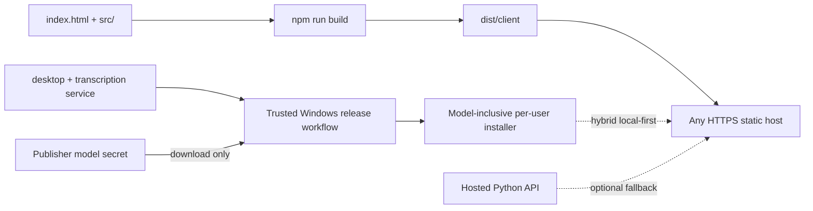

# Architecture

NotesBuddy consists of a dependency-free static browser client and a Python
service that can run as a paired Windows companion or a hosted anonymous API.
The client owns microphone/browser-fallback capture, browser storage, playback,
and UI. The companion owns Windows-output capture plus local speech-to-text and
speaker diarization.

## Design goals

- Keep original recordings and meeting records local by default.
- Capture local and remote audio as separate synchronized sources.
- Never fabricate transcript or summary text.
- Make unsupported capabilities and failed permissions explicit.
- Keep controls stable during recording and playback.
- Preserve legacy single-recording meetings.
- Avoid placing model credentials in the static client.
- Keep local pairing and hosted access behind one browser job contract.
- Give hosted prototype jobs short-lived ownership and bounded compute.

## Runtime overview

```mermaid
flowchart LR
    Mic["Local microphone"] --> MicStream["Microphone MediaStream"]
    Windows["Default Windows output"] --> Loopback["Companion WASAPI loopback"]
    Share["Browser share fallback"] --> MeetingStream["Meeting MediaStream"]
    MicStream --> MicRecorder["Microphone MediaRecorder"]
    Loopback --> MeetingWav["Temporary stereo WAV"]
    MeetingWav -->|"~5s trailing-window re-transcription"| LiveCaption["Live guest caption (in-progress)"]
    LiveCaption -->|"partial-transcript poll"| Client
    MeetingStream --> MeetingRecorder["Meeting MediaRecorder"]
    MicStream --> Mixer["Web Audio mixer"]
    MeetingStream --> Mixer
    Mixer --> MixedRecorder["Mixed MediaRecorder"]
    MicRecorder --> IDB["IndexedDB recordings"]
    MeetingWav -->|"Protected loopback transfer + delete"| IDB
    MeetingRecorder --> IDB
    MixedRecorder --> IDB

    MicStream --> BrowserSpeech["Browser speech draft (optional)"]
    BrowserSpeech --> LocalStorage["localStorage meeting record"]

    IDB --> Client["NotesBuddy client"]
    Client --> Discovery["Companion discovery + exact-origin pairing"]
    Discovery -->|"Available: memory-only token"| Companion["127.0.0.1 desktop companion"]
    Discovery -->|"Unavailable: disclosed fallback"| Hosted["Hosted API (optional)"]
    Companion --> Whisper["faster-whisper words"]
    Hosted --> Whisper
    Companion --> Pyannote["pyannote remote turns"]
    Hosted --> Pyannote
    Whisper --> Alignment["Timestamp alignment + echo de-duplication"]
    Pyannote --> Alignment
    Alignment --> Client
    Client -->|"completed transcript only"| AnalysisRouter["Prefer local companion, else hosted"]
    AnalysisRouter --> LocalAnalyzer["Companion: llama.cpp + one installed GGUF tier"]
    AnalysisRouter --> Analyzer["Hosted meeting analyst"]
    LocalAnalyzer --> Grounding["Evidence and field validation"]
    Analyzer --> Grounding
    Grounding --> Client
    Client --> LocalStorage
```



## Browser components

### `index.html`

Direct-launch entry point. It loads `src/runtime-config.js`, then
`src/meeting-audio.js`, then `src/app.js` using relative paths, so both HTTP and
`file://` launch paths work.

### `src/runtime-config.js`

Contains public, non-secret deployment configuration: local/hosted/hybrid mode,
the loopback endpoint, optional verified hosted fallback, and companion
download URL. An empty hosted endpoint deliberately disables cloud fallback.
Credentials must never be placed in this file.

### `src/meeting-audio.js`

Framework-independent browser module containing:

- recording-asset migration and source selection;
- speaker normalization and labels;
- transcript result normalization;
- cross-source echo de-duplication;
- speaker rename propagation;
- structured analysis-response validation;
- companion discovery, automatic pairing, and health verification;
- local-pairing and hosted anonymous-session API client.

The module uses a classic global (`NotesBuddyMeetingAudio`) so direct local-file
launch does not depend on ES module CORS behavior. Its pure functions are tested
under Node.

### `src/app.js`

Owns:

- application, settings, profile, and capture state;
- template rendering and event delegation;
- microphone, companion-loopback, and display-fallback permission flow;
- coordinated browser `MediaRecorder` instances plus companion WAV transfer;
- optional browser speech-recognition draft, always attributed to **You**;
- live companion polling for guest captions during recording, wholesale-
  replacing the provisional **Guest** rows on every poll and time-sorting the
  merged live segment list;
- IndexedDB storage and `localStorage` metadata;
- audio hydration, playback, seeking, source download;
- transcription job lifecycle and cancellation;
- professional-analysis lifecycle, migration, rendering, and refresh;
- speaker roster, rename UI, search, copy, export, notes, and actions.

Timer, live transcript, source-status, and interrupted-share warning updates
modify narrow DOM regions. This avoids replacing recording controls every
second. Full rendering preserves the current audio asset and position when
possible.

### `src/styles.css`

Defines design tokens, responsive layouts, recording/source states, speaker and
transcription panels, reduced-motion behavior, mobile navigation, and the 320 px
minimum supported layout.

### `server.mjs`

Dependency-free development server bound to `127.0.0.1:4173`. It applies
no-cache headers and an `index.html` fallback.

### `build.mjs`

Recreates `dist/`, including `meeting-audio.js`, and copies the static client
plus the existing worker/hosting metadata. Generated client assets are tracked
and validated against source by `npm test`.

## Capture lifecycle

1. Confirm at least one source is selected.
2. If compatible companion capability `systemAudioCapture` is connected,
   request microphone permission first, then start a protected stereo 48 kHz
   WASAPI loopback capture of the default Windows output.
3. Otherwise, call `getDisplayMedia()` immediately from the start-button
   activation and request the microphone second. Verify the share contains an
   audio track; its video track remains alive but is never recorded or stored.
4. Create isolated microphone and meeting streams. Browser fallback also builds
   a mixed Web Audio stream; companion capture preserves separate microphone
   and Windows-output tracks.
5. Start browser recorders together and collect chunks every 500 ms. Poll the
   companion for current output level, or analyze the browser meeting track,
   and merge active samples into capture-clock meeting-activity spans (this
   still drives the **Guest speaking** placeholder shown before any live
   words arrive).
6. Browser-recognized microphone speech is always **You**. With a compatible
   companion connected, poll it every ~5s for a live re-transcription of a
   trailing window of the meeting-audio recording and show the result as
   **Guest** -- real transcribed content, not a timing guess, and unaffected
   by whether headphones prevent acoustic leakage into the microphone. See
   [Live captions](#live-captions-partial-transcription) below.
7. Pause/resume browser recorders, mixer, and companion capture together.
8. On finish, stop browser recorders and download the companion WAV before
   stopping local tracks. The companion deletes its temporary file after the
   response.
9. Persist each non-empty Blob independently, prefer Windows output for playback
   when no mixed track exists, then store the meeting/source metadata.

Final transcription is authoritative: `applyTranscriptionResult()` replaces
the whole capture-time draft and roster. It never appends pyannote speakers to
the provisional **Guest**, so post-processing produces one reconciled timeline
without duplicate rows.

If companion or display capture fails, microphone capture continues.
If the user ends sharing during a meeting, the UI marks the meeting source
ended, inserts a persistent warning, and keeps the microphone path active.

## Persistence

### `localStorage`

| Key | Contents |
| --- | --- |
| `notesbuddy-profile` | Local profile ID, name, initials, timestamps |
| `notesbuddy-meetings` | Meetings, asset metadata, speakers, transcript, notes, actions |
| `notesbuddy-settings` | Capture defaults, deployment-safe service settings, processing preferences |

Hybrid automatic tokens are never stored. They remain in the current page's
memory and are revoked on reload, expiry, or companion restart. Explicit manual
CLI mode can still store a recovery token in browser settings.

### IndexedDB

- Database: `notesbuddy-audio`
- Version: `1`
- Object store: `recordings`
- New asset keys:
  - `<meeting-id>:microphone`
  - `<meeting-id>:meeting`
  - `<meeting-id>:mixed`

New meetings retain `audioId` pointing to their preferred playback asset for
compatibility. `recordingAssets` is authoritative. Legacy meetings containing
only `audioId` are exposed as a virtual mixed asset without rewriting the Blob.
Deletion enumerates and removes every unique asset ID.

Profile, meeting, import, transcript, and job identifiers use UUIDs. A profile
ID is not authentication or a server session.

## Transcription service

The shared engine and API live under `services/transcription/`.

### Security boundary

- Launcher binds Uvicorn to `127.0.0.1`.
- CORS allows only configured origins.
- Modern private-network preflight is supported for trusted origins.
- Discovery returns only non-secret compatibility metadata.
- The desktop launcher issues origin-bound, expiring, in-memory browser tokens
  only after exact-origin validation.
- Missing, `null`, and unknown origins cannot pair automatically.
- Protected endpoints require `X-NotesBuddy-Pairing-Token`.
- A persistent 256-bit manual recovery token remains under the OS user profile.
- Uvicorn access logs are disabled by the launcher.
- Normal API responses/logs do not include transcript content or audio paths
  except the transcript returned to the paired requesting client.

### Job lifecycle

1. Validate token, metadata, source presence, and per-source size.
2. Stream multipart uploads into a random OS temporary directory.
3. Queue the job in a bounded executor (one worker by default).
4. Lazily load model adapters.
5. Transcribe the microphone track and assign every word to `local-user`.
6. Transcribe the meeting track. For mixed-only imports, use mixed as the
   remote source; a mic-only mixed duplicate is intentionally skipped.
7. Diarize remote audio and prefer exclusive speaker intervals when available.
8. Map model labels to `remote-1`, `remote-2`, and so on in first-appearance
   order.
9. Assign words to intervals by greatest overlap. Only a 350 ms rounding
   tolerance is permitted; otherwise use `remote-unknown`.
10. Collapse adjacent words, merge source segments by shared timestamps, and
    remove near-identical overlapping cross-source echo.
11. Return JSON and remove the temporary job directory in `finally`.

Cancellation sets a cooperative event. Native model work may finish its current
operation before observing it, but terminal cleanup always runs.

### Live captions (partial transcription)

A second, independent path runs alongside the job lifecycle above while a
system-audio capture is active, so guest speech can appear in the live
transcript instead of only after **Transcribe and identify speakers**:

1. `SystemAudioCaptureManager` starts a background thread per capture (only
   when a `chunk_transcriber` was injected -- `server.py` wires in
   `LocalDiarizationEngine.transcribe_chunk`) alongside the existing WASAPI
   recorder thread.
2. Every ~5 seconds, it reads `capture.frame_count` under `capture.lock` as a
   safe lower bound on frames actually written so far, then reads raw PCM
   bytes directly from the WAV file the recorder thread is still writing --
   in the same process, bypassing the `wave` module, since a separate OS
   process cannot safely read a file mid-write (unflushed buffers, a header
   size only patched on close). This bounds the read to a trailing ~25-second
   window, independent of total recording length, so tick latency stays flat.
3. `transcribe_chunk()` resamples the chunk to the model's native rate (only
   the full-file path gets ffmpeg-quality resampling; this is a lower-quality,
   dependency-free stand-in acceptable only for a best-effort live draft),
   then runs it through the same lazily-loaded, already-warm faster-whisper
   model the job lifecycle uses -- guarded by a shared inference lock that the
   live path acquires non-blocking (skipping that tick on contention) so a
   caption tick never queues behind a multi-minute diarization job.
4. Results are served over `GET
   /v1/system-audio/captures/{id}/partial-transcript`, gated by the same
   `require_local_system_audio_access` dependency as its sibling routes.
   `src/app.js` polls it alongside the existing status poll and
   wholesale-replaces the live provisional-**Guest** rows on every response
   (mirroring how the final diarized transcript already wholesale-replaces
   every provisional row, rather than tracking incremental cursor/dedup
   state), then re-sorts the merged live segment list by timestamp, since a
   guest word from a several-second-delayed poll can carry an earlier
   timestamp than a microphone segment already on screen.

The whole per-tick body is one unit wrapped in a single broad exception
handler: any failure (a bad read, a conversion error, a transcription error)
skips just that tick rather than killing the background thread, since a
thread's exception has nowhere to propagate and would otherwise silently stop
live captions for the rest of that recording. The thread is explicitly
stopped and joined on `.stop()`/`.cancel()`/`.shutdown()`, before the real
end-of-recording transcription for that same file can need the same
inference lock.

### Hosted anonymous boundary

`NOTESBUDDY_ACCESS_MODE=anonymous` changes authentication without changing the
job/model contract:

1. `POST /v1/sessions` issues a random expiring browser-session token.
2. Only its SHA-256 digest is kept by the service.
3. Job creation reserves bounded compute for that session.
4. Every read/cancel request must present the owning session token.
5. Requests for another session's job return `404`.
6. Session creation is rate-limited by a hashed client network key.

The Modal package runs one autoscaled GPU container so the in-memory session and
job stores remain coherent during the prototype. Model weights are cached in a
persistent volume; meeting audio and transcript results are not written there.
Production horizontal scaling requires durable sessions, queues, job ownership,
and result storage.

### Model adapter

`LocalDiarizationEngine` loads faster-whisper and pyannote lazily. Packaged
Windows releases resolve both from the offline `models` directory, so customers
do not need a model token. The trusted release job uses the publisher's secret
once, records immutable model revisions, and never includes that secret in the
artifact. `EmptyEngine` exists only for API/security smoke tests and returns an
empty segment array. It never returns demonstration text.

### Speaker diarization worker and GPU acceleration

A real install always delegates diarization to an isolated
`NotesBuddySpeakerWorker.exe` subprocess (`NOTESBUDDY_SPEAKER_WORKER`,
wired by `components.py`'s `configure_component_environment`) rather than
running pyannote in-process inside `LocalDiarizationEngine._diarize()` --
that in-process path only exists for dev/test scenarios without a worker
configured. `NotesBuddyCompanion.spec` explicitly excludes `torch`,
`torchaudio`, and `pyannote`/`pyannote.audio` from the main companion
build, confirming this is deliberate rather than incidental.

CPU diarization was confirmed CPU-bound, not GPU-idle by mistake: a real
~1 hour meeting took roughly an hour to diarize, `nvidia-smi` showed 0% GPU
utilization throughout, and `torch/version.py` in both the main companion's
bundle and the worker's own separate bundle read `+cpu` -- neither has any
CUDA support at all, because `requirements-models.txt` pins `torch>=2.6`
with no CUDA index, so pip resolves PyPI's default (CPU-only) Windows
wheel. Two fixes followed from that root cause:

1. **Free, always-on**: neither the worker nor the in-process path
   configured PyTorch's CPU thread pool at all before this. Shared
   `notesbuddy_transcription/cpu_threads.py` resolves a thread count (every
   logical core by default, overridable via
   `NOTESBUDDY_DIARIZATION_CPU_THREADS`) and applies it -- as
   `OMP_NUM_THREADS`/`MKL_NUM_THREADS` env defaults before the worker's
   first `import torch` (env vars only take effect at native thread-pool
   init, so this must run before that import), and via a direct
   `torch.set_num_threads()`/`set_num_interop_threads(1)` call for the
   in-process fallback.
2. **Opt-in GPU**: a second executable, `NotesBuddySpeakerWorkerGPU.exe`,
   built from the exact same `speaker_worker.py` entry point but with a
   CUDA-enabled torch/torchaudio installed in its build venv instead
   (`.github/workflows/speaker-worker.yml` builds both variants).
   `speaker_worker.py` detects `torch.cuda.is_available()` at runtime and
   moves the pipeline to `cuda` when true, so the CPU-only build (whose
   torch always reports no CUDA) naturally stays on CPU with no separate
   code path. Packaged as the `speaker-diarization-cuda` component,
   installed into its own `speaker-gpu` destination -- never the base
   `speaker` one the CPU worker and the shared pyannote model live in,
   since component installation is a wholesale directory swap
   (`components.py`'s `_install_one`), and `analysis-cuda` already hit
   exactly this bug once by sharing a destination with a component that had
   a file of its own to preserve. `LocalDiarizationEngine.__init__` prefers
   `NOTESBUDDY_SPEAKER_WORKER_GPU` over `NOTESBUDDY_SPEAKER_WORKER` when
   present; the shared model directory is untouched either way.

Confirmed live (2026-09-05) on a real ~24 minute meeting recording: 62s on
GPU vs. 731s on tuned CPU (11.8x), with identical speaker-turn output on
both -- real speech fully exercises pyannote's clustering stage, unlike an
earlier synthetic-audio test that produced zero detected turns, so this
result settles the open question of whether clustering would stay
CPU-bound regardless of the neural-net stages moving to GPU. It does not.

### Local analysis (smart summary)

`LocalAnalysisRouter` resolves the analysis component installed on the paired
companion and is the default analyzer whenever `NOTESBUDDY_ANALYSIS_MODEL` is
unset (i.e. for every packaged companion). It shells out to a pinned
`llama.cpp` (`llama-cli`) build against one of three independently
downloadable GGUF models, sharing one destination directory so installing a
different quality tier replaces the previous one. Settings can trigger that
same install/replace flow at any time after initial setup, not only during
first-time onboarding.

The bundled runtime is CPU-only by default -- confirmed structural, not a
missed flag, by downloading and inspecting llama.cpp's own official
`-bin-win-cpu-x64.zip` release asset. An optional `analysis-cuda` component
carries the GPU-capable alternative build instead, installed into its own
`analysis-gpu` destination rather than the GGUF tiers' shared `analysis`
one -- component installation is a wholesale directory swap, not a file
overlay, so a runtime-only package sharing that directory would silently
delete whichever GGUF was installed there. `LocalAnalysisRouter` prefers
this separate runtime, when present, over the CPU-only one; the GGUF always
resolves from the untouched `analysis` directory regardless of which
runtime is active. `LlamaCppMeetingAnalyzer` passes `-ngl 999` only when the installed
runtime actually has `ggml-cuda.dll` next to it *and* `engine.local_accelerator("auto")`
-- the exact same CUDA-availability probe `LocalDiarizationEngine` already
uses for speech-to-text, not a second detector -- reports a usable GPU. A
GPU-flagged run that exits non-zero retries once on CPU rather than failing
the analysis outright.

| Tier | Model | Notes |
| --- | --- | --- |
| `analysis-tiny` (Fast) | Qwen2.5-0.5B-Instruct | Smallest download; raw output was found to fail evidence-grounding validation almost entirely on real meeting speech |
| `analysis-standard` (Balanced, recommended) | Qwen3-1.7B | Reliably produces grounded, validated highlights and decisions |
| `analysis-pro` (High quality) | Qwen3-4B-Instruct-2507, Q3_K_M | Richest, most specific output; markedly slower on CPU, and needs a larger `--predict` output budget to reliably finish its JSON |

A long transcript is split into chunks sized well below the model's raw
context window -- this is about the model's effective reasoning span, not
`--ctx-size`; a 0.5B model was observed to lose coherence and degenerate into
repetition once asked to track and cite more than roughly a hundred segment
IDs in one completion, well before running out of context. Per-chunk results
are combined deterministically (concatenate, then re-run the same
evidence-grounding validation used for a single chunk) rather than asking the
model to re-synthesize its own already-valid JSON output, which was observed
to degrade a real multi-chunk result even though every individual chunk had
analyzed cleanly on its own.

`createMeetingAnalysisClient()` in `src/app.js` prefers the paired companion
whenever it reports `analysisAvailable: true`, falling back to the hosted
analyzer only when no local analysis component is installed. See
[Privacy and data handling](PRIVACY.md#professional-meeting-analysis) for the
resulting data-boundary behavior.

When a chunk's own shortSummary fails evidence-grounding, one reinforced retry
re-sends the full prompt with an explicit correction before falling back to
concatenating structured field text (which reads as disconnected labels, not
prose). That retry regenerates the entire response, including highlights,
decisions, and actionItems -- a real chunk's retry once returned a corrected
summary but completely empty structured fields, because the retry prompt's
narrow focus on the summary pulled the model's attention off everything else,
and the first attempt's own fields were never actually invalidated (a bad
summary makes validation raise before anything else is checked). The retry
now combines both attempts' raw highlights/decisions/actionItems before
validation rather than using only whichever attempt happened to include them.
The cross-chunk merge has an analogous fix: it trusts each already-validated
partial's own summary instead of re-running the same strict grounding check
against their concatenation, which was observed to fail even when every
partial was individually sound (concatenation dilutes the token-overlap ratio
and a number or time phrase valid against one chunk's own evidence can trip a
whole-text subset check).

Analysis reports live progress through a token-based polling side channel
(`POST /v1/analyses` accepts an optional `progressToken`; `GET
/v1/analyses/progress/{token}` returns its current stage and 0-1 fraction)
rather than a streaming response, since the main request must stay a single
blocking call for compatibility with the hosted/Modal deployment. The browser
client polls that endpoint on its own short interval while the main request
is still in flight and stops once it resolves.

## Speaker model

```js
{
  id: "remote-1",
  displayName: "Speaker 1",
  source: "meeting",
  color: "violet",
  isLocalUser: false
}
```

Transcript segments reference `speakerId`. Renaming updates the speaker record,
matching displayed segments, participants, search, copy, and Markdown export
without changing model timestamps or the stable session-local ID.

The special `local-user` display label is always **You**. Its descriptive name
and initials come from the local profile. Changing the profile synchronizes
existing local speaker metadata and locally owned follow-ups.

## Transcript and analysis integrity

- Browser recognition is marked as a draft.
- A completed companion result replaces the draft authoritatively.
- Empty model results produce an empty transcript.
- Unknown assignments remain **Unknown speaker**.
- The browser does not generate insights from keywords or placeholder text.
- Professional analysis receives the complete finalized speaker transcript,
  not the provisional live browser draft and not recording audio.
- The model must return structured JSON and cite real transcript segment IDs
  for the summary and every highlight, decision, and action item.
- Server validation requires lexical support in cited evidence, explicit
  decision/commitment language, and real evidence for owners and due dates.
- Unsupported decision context and action notes become **Not specified**;
  unsupported High/Low priority becomes **Medium**.
- Suggestions and unresolved questions are never accepted as confirmed
  decisions. Items without valid evidence are removed.
- The short summary is limited to 299 words. Duplicate list items are removed.
- Existing keyword-generated records are cleared and marked outdated during
  migration; the user can refresh a completed transcript into the new schema.
- Empty recordings and imports do not receive generic review actions.
- Refreshing an analysis with no completed transcript shows an unavailable message rather
  than inventing content.

## Build and deployment boundary



The Python service is never part of the static bundle. Hybrid mode first talks
to the automatically paired `127.0.0.1` process and does not contact the hosted
API while that companion is active. If local connection fails, the UI discloses
the fallback before jobs use the HTTPS endpoint in `runtime-config.js`.
