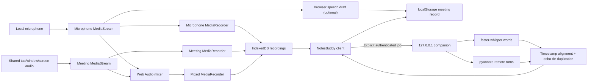
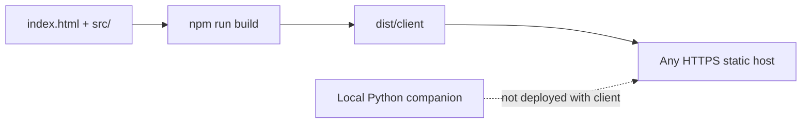

# Architecture

NotesBuddy consists of a dependency-free static browser client and an optional
Python companion running on the same computer. The client owns capture, browser
storage, playback, and UI. The companion owns speech-to-text and speaker
diarization.

## Design goals

- Keep original recordings and meeting records local by default.
- Capture local and remote audio as separate synchronized sources.
- Never fabricate transcript or summary text.
- Make unsupported capabilities and failed permissions explicit.
- Keep controls stable during recording and playback.
- Preserve legacy single-recording meetings.
- Avoid placing model credentials in the static client.

## Runtime overview



## Browser components

### `index.html`

Direct-launch entry point. It loads `src/meeting-audio.js` before `src/app.js`
using relative paths, so both HTTP and `file://` launch paths work.

### `src/meeting-audio.js`

Framework-independent browser module containing:

- recording-asset migration and source selection;
- speaker normalization and labels;
- transcript result normalization;
- cross-source echo de-duplication;
- speaker rename propagation;
- extractive brief generation;
- authenticated local-companion API client.

The module uses a classic global (`NotesBuddyMeetingAudio`) so direct local-file
launch does not depend on ES module CORS behavior. Its pure functions are tested
under Node.

### `src/app.js`

Owns:

- application, settings, profile, and capture state;
- template rendering and event delegation;
- microphone/display permission flow;
- three coordinated `MediaRecorder` instances;
- optional browser speech-recognition draft;
- IndexedDB storage and `localStorage` metadata;
- audio hydration, playback, seeking, source download;
- transcription job lifecycle and cancellation;
- speaker roster, rename UI, search, copy, export, notes, and actions.

Timer, live transcript, source-status, and interrupted-share warning updates
modify narrow DOM regions. This avoids replacing recording controls every
second. Full rendering preserves the current audio asset and position when
possible.

### `src/styles.css`

Defines design tokens, responsive layouts, recording/source states, speaker and
transcription panels, reduced-motion behavior, mobile navigation, and the 320 px
minimum supported layout.

### `server.mjs`

Dependency-free development server bound to `127.0.0.1:4173`. It applies
no-cache headers and an `index.html` fallback.

### `build.mjs`

Recreates `dist/`, including `meeting-audio.js`, and copies the static client
plus the existing worker/hosting metadata. Generated client assets are tracked
and validated against source by `npm test`.

## Capture lifecycle

1. Confirm at least one source is selected.
2. If meeting audio is selected, call `getDisplayMedia()` immediately from the
   start-button activation. The user chooses a surface and enables **Share
   audio**. It is requested before the microphone because display capture
   requires transient user activation.
3. Request the microphone independently with echo cancellation, noise
   suppression, and automatic gain control.
4. Verify the display stream includes audio. The required video track stays
   alive only to maintain the browser share; it is never recorded or stored.
5. Create isolated microphone and meeting streams.
6. Create a mixed audio stream using Web Audio when both sources exist. For one
   source, reuse its audio track in a mixed `MediaStream`.
7. Construct every recorder before starting any. Start all recorders from one
   capture session and collect chunks every 500 ms.
8. Pause/resume all recorders and the mixer together.
9. On finish, stop and collect every recorder before stopping tracks.
10. Persist each non-empty Blob independently. A single source write failure
    does not claim the other sources failed.
11. Store the meeting record and source metadata.

If display capture is denied or returns no audio, microphone capture continues.
If the user ends sharing during a meeting, the UI marks the meeting source
ended, inserts a persistent warning, and keeps the microphone path active.

## Persistence

### `localStorage`

| Key | Contents |
| --- | --- |
| `notesbuddy-profile` | Local profile ID, name, initials, timestamps |
| `notesbuddy-meetings` | Meetings, asset metadata, speakers, transcript, notes, actions |
| `notesbuddy-settings` | Capture defaults, companion endpoint/token, processing preferences |

### IndexedDB

- Database: `notesbuddy-audio`
- Version: `1`
- Object store: `recordings`
- New asset keys:
  - `<meeting-id>:microphone`
  - `<meeting-id>:meeting`
  - `<meeting-id>:mixed`

New meetings retain `audioId` pointing to their preferred playback asset for
compatibility. `recordingAssets` is authoritative. Legacy meetings containing
only `audioId` are exposed as a virtual mixed asset without rewriting the Blob.
Deletion enumerates and removes every unique asset ID.

Profile, meeting, import, transcript, and job identifiers use UUIDs. A profile
ID is not authentication or a server session.

## Local companion

The companion lives under `services/transcription/`.

### Security boundary

- Launcher binds Uvicorn to `127.0.0.1`.
- CORS allows only configured origins.
- Modern private-network preflight is supported for trusted origins.
- Every API endpoint requires `X-NotesBuddy-Pairing-Token`.
- A persistent 256-bit token is stored under the local OS user profile.
- Uvicorn access logs are disabled by the launcher.
- Normal API responses/logs do not include transcript content or audio paths
  except the transcript returned to the paired requesting client.

### Job lifecycle

1. Validate token, metadata, source presence, and per-source size.
2. Stream multipart uploads into a random OS temporary directory.
3. Queue the job in a bounded executor (one worker by default).
4. Lazily load model adapters.
5. Transcribe the microphone track and assign every word to `local-user`.
6. Transcribe the meeting track. For mixed-only imports, use mixed as the
   remote source; a mic-only mixed duplicate is intentionally skipped.
7. Diarize remote audio and prefer exclusive speaker intervals when available.
8. Map model labels to `remote-1`, `remote-2`, and so on in first-appearance
   order.
9. Assign words to intervals by greatest overlap. Only a 350 ms rounding
   tolerance is permitted; otherwise use `remote-unknown`.
10. Collapse adjacent words, merge source segments by shared timestamps, and
    remove near-identical overlapping cross-source echo.
11. Return JSON and remove the temporary job directory in `finally`.

Cancellation sets a cooperative event. Native model work may finish its current
operation before observing it, but terminal cleanup always runs.

### Model adapter

`LocalDiarizationEngine` loads faster-whisper and pyannote lazily. `EmptyEngine`
exists only for API/security smoke tests and returns an empty segment array. It
never returns demonstration text.

## Speaker model

```js
{
  id: "remote-1",
  displayName: "Speaker 1",
  source: "meeting",
  color: "violet",
  isLocalUser: false
}
```

Transcript segments reference `speakerId`. Renaming updates the speaker record,
matching displayed segments, participants, search, copy, and Markdown export
without changing model timestamps or the stable session-local ID.

The special `local-user` display label is always **You**. Its descriptive name
and initials come from the local profile. Changing the profile synchronizes
existing local speaker metadata and locally owned follow-ups.

## Transcript and brief integrity

- Browser recognition is marked as a draft.
- A completed companion result replaces the draft authoritatively.
- Empty model results produce an empty transcript.
- Unknown assignments remain **Unknown speaker**.
- Extractive briefs contain only complete transcript segment text.
- Refreshing a brief with no transcript shows an unavailable message rather
  than inventing content.

## Build and deployment boundary



The companion is never part of the static bundle. A hosted static page talks
only to the explicitly paired `127.0.0.1` process. This feature branch does not
merge or deploy `main`.
