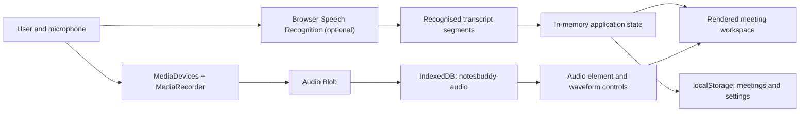
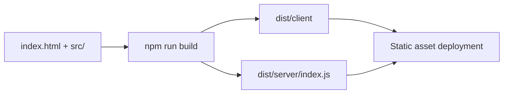

# Architecture

NotesBuddy is a dependency-free single-page browser application. Application
state, rendering, media capture, and persistence are implemented in
`src/app.js`; static seed data and the visual system are separate source files.

## Design goals

- Keep recordings local by default.
- Run directly from `index.html`.
- Avoid a package-installation step.
- Fail honestly when a browser capability is unavailable.
- Keep active recording and playback controls stable during UI updates.
- Produce a small, static deployment artifact.

## Runtime overview

## Source components

### `index.html`

The direct-launch entry point. It loads `src/data.js`, `src/app.js`, and
`src/styles.css` with relative paths so the app works through both `file://` and
an HTTP server.

### `src/data.js`

Contains seed meetings used to demonstrate summaries, transcripts, action
items, and library search. Seed meetings do not pretend to have locally stored
audio.

### `src/app.js`

Owns:

- Application and capture state
- Template rendering and event delegation
- Microphone permission and MediaRecorder lifecycle
- Optional browser speech recognition
- IndexedDB audio storage
- `localStorage` meeting and settings persistence
- Audio hydration, playback synchronization, seeking, and downloads
- Import, export, clipboard, notes, filtering, and responsive navigation

The app uses escaped template output for user-editable values. Runtime capture
updates change only the timer and transcript regions so controls remain stable.
Playback UI updates are synchronized from audio media events.

### `src/styles.css`

Defines the design tokens, component layouts, animations, responsive rules, and
mobile navigation. The minimum supported layout width is 320 px.

### `server.mjs`

A small static server for local development and preview. It listens on
`127.0.0.1:4173`, applies no-cache headers, and falls back to `index.html` for
unknown routes.

### `build.mjs`

Recreates `dist/` and copies the static client, Sites worker, and hosting
metadata. Source and generated client files should be committed together.

### `site-worker.mjs`

Delegates static requests to the deployment asset binding and supplies an
`index.html` fallback for extensionless application routes.

## Persistence model

### `localStorage`

| Key | Contents |
| --- | --- |
| `notesbuddy-meetings` | Meeting metadata, transcript segments, summaries, actions, and notes |
| `notesbuddy-settings` | Capture, transcription, summary, and audio-retention preferences |

### IndexedDB

- Database: `notesbuddy-audio`
- Version: `1`
- Object store: `recordings`
- Key: meeting/audio identifier
- Value: audio `Blob`

A meeting stores an `audioId` only when its Blob was successfully written.
Deleting a meeting also removes its associated IndexedDB object.

## Recording lifecycle

1. Reset capture state.
2. Request an audio-only microphone stream.
3. Select the best supported MediaRecorder type.
4. Collect non-empty chunks every 500 ms.
5. Pause or resume both the recorder and capture timer.
6. Stop recognition and MediaRecorder when the user finishes.
7. Combine chunks into one Blob.
8. Store the Blob in IndexedDB when audio retention is enabled.
9. Store the meeting record in `localStorage`.
10. Hydrate the audio element with a temporary object URL.

## Speech-recognition lifecycle

Speech recognition is optional and capability-detected. Final results become
transcript segments; interim text appears only during capture. Errors do not
stop MediaRecorder. When the API is absent or fails, the UI says that live text
is unavailable and the original recording continues.

NotesBuddy does not infer transcript text from the audio Blob and does not add
demonstration text to newly recorded meetings.

## Build and deployment

The generated output is intentionally tracked because the connected Sites
deployment consumes that exact repository state.

## Extension points

Features such as offline transcription, diarization, encrypted storage, local
LLM summaries, and system-audio capture should be introduced behind explicit
interfaces. They should not weaken the current privacy disclosures or silently
change where data is processed.
