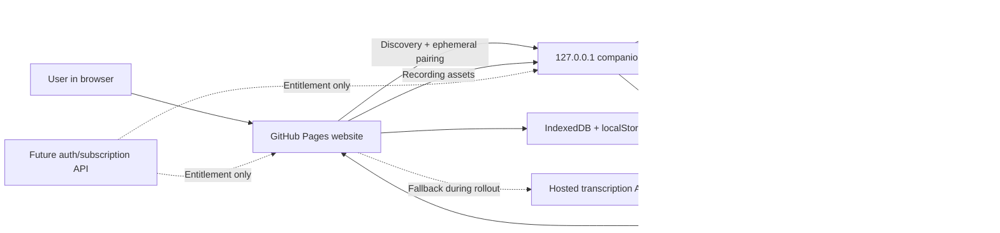

# NotesBuddy desktop companion plan

## Status

Implementation target: Windows-first local companion with a hybrid public-site
rollout.

The currently deployed hosted transcription service remains available while
the companion is developed and adopted. Installing the companion changes the
processing location, not the recording, transcript, playback, or export data
contracts.

## Product objective

Let a visitor open the public NotesBuddy website, install one Windows
application, and have transcription and speaker diarization run on that
computer without centrally hosted GPU inference.

The target experience is:

1. The visitor opens NotesBuddy.
2. NotesBuddy checks for a companion on `127.0.0.1`.
3. If the companion is present, the trusted NotesBuddy origin receives an
   ephemeral browser-pairing token.
4. Browser recordings are sent to the loopback service only.
5. Whisper and diarization run locally.
6. The completed JSON transcript returns to the browser and is stored with the
   meeting.
7. If the companion is absent or not ready during rollout, the existing hosted
   service remains an explicit fallback.

The user's computer is not turned into a public server. The companion binds to
loopback only and serves only that signed-in OS user.

## Goals

- One Windows installer and a normal Start-menu application.
- A control window and notification-area lifecycle.
- Automatic public-site discovery and origin-scoped browser pairing.
- No persistent pairing secret compiled into the website.
- Local CPU inference by default, with optional supported CUDA acceleration.
- Existing microphone, meeting, and mixed-track upload contract.
- Existing transcript, speaker rename, playback, notes, summary, and export
  behavior.
- No retained temporary job audio after terminal job state.
- Hosted fallback during migration and an easy rollback switch.
- A future subscription service that validates identity and entitlement but
  does not need to process meeting audio.

## Non-goals for the first installable milestone

- Silently recording the operating system without an explicit user action.
- Replacing browser capture with native WASAPI loopback in the first release.
- Shipping a centrally managed Hugging Face credential inside the executable.
- Claiming that speaker labels identify real people.
- Multi-user LAN hosting, inbound internet access, or opening firewall ports.
- A production payment or account system.
- Automatic redistribution of gated model files before licensing and
  attribution review is complete.

Native WASAPI microphone and loopback capture is a follow-up milestone. It can
use the same local API and transcript contract after the compute companion is
stable.

## Target architecture

## Runtime modes

### `local`

Manual/developer mode. The website uses the configured loopback endpoint and
pairing token. This remains available for diagnostics and non-packaged use.

### `hosted`

The existing anonymous hosted service. It remains available for rollback and
for users who cannot install the companion.

### `hybrid`

The public rollout mode:

1. Start with the hosted endpoint available.
2. Probe the fixed loopback companion endpoint.
3. If discovery and browser pairing succeed, select local mode.
4. If the companion cannot be reached, continue with hosted mode.
5. Recheck when the user chooses **Look for companion**.
6. Never switch an already-running transcription job between services.

The active service and privacy consequence must be visible in Settings.

## Companion lifecycle

### Install

- Install per user by default.
- Add a Start-menu shortcut and optional desktop shortcut.
- Do not request administrator privileges unless a future signed installer
  feature genuinely requires them.
- Do not add a firewall rule because the service is loopback-only.
- Offer start-with-Windows as an opt-in setting.

### Start

- Enforce one companion per user/port.
- Load the UI and local API before loading speech models.
- Bind Uvicorn to `127.0.0.1`, never `0.0.0.0`.
- Enable automatic browser pairing only in the packaged desktop launcher.
- Load models lazily on the first transcription job.

### Normal operation

- The main window reports service, processing, model, and privacy status.
- Closing the window hides it to the notification area when tray support is
  available.
- The tray provides **Open NotesBuddy**, **Show companion**, and **Quit**.
- The manual pairing token remains available for recovery but is not part of
  the normal website flow.

### Stop and uninstall

- Stop accepting new jobs.
- Signal the current Uvicorn process to exit.
- Remove autostart registration on uninstall.
- Keep or remove downloaded model caches only after an explicit user choice.
- Remove pairing credentials if the user chooses a full data removal.

## Browser discovery and pairing

### Discovery

The local-only `GET /v1/companion` endpoint returns non-sensitive capability
metadata:

- product and companion version;
- loopback status;
- active engine name;
- whether browser pairing is available;
- local temporary-storage policy.

It never returns a pairing token, filesystem path, model credential, meeting
metadata, or transcript.

### Browser pairing

The packaged companion enables `POST /v1/pairings`.

The server:

1. requires an `Origin` header;
2. accepts only an exact configured HTTPS NotesBuddy origin or explicit local
   development origin;
3. rejects `Origin: null` for automatic pairing;
4. issues a random, expiring, in-memory token scoped to the trusted origin;
5. bounds the number of active browser pairings;
6. returns `Cache-Control: no-store`;
7. loses browser pairings when the companion exits.

The website stores the ephemeral token in that browser origin's local settings.
If the companion restarts and rejects it, the website repeats discovery and
pairing. The persistent manual recovery token is never returned by the
automatic endpoint.

This protects against ordinary unrelated websites. It is not a boundary
against malware already running as the same OS user, which could inspect local
processes and files.

## Local network and browser permissions

The public website is HTTPS and the companion is HTTP loopback. The companion
must:

- handle standard CORS preflights;
- allow only exact trusted origins;
- return the browser's required local/private-network opt-in header when
  requested;
- explain the Chrome/Edge local-network permission prompt;
- keep a manual pairing recovery path for browser-policy changes.

No wildcard origin is allowed on a token-bearing route.

## Recording and transcription flow

The first milestone keeps recording in the browser:

1. The user explicitly starts capture.
2. The browser requests microphone and optional shared meeting audio.
3. NotesBuddy records isolated microphone, meeting, and mixed assets.
4. The assets stay in IndexedDB.
5. On transcription, the browser uploads them to `127.0.0.1`.
6. The companion writes one random temporary directory.
7. Whisper transcribes isolated sources.
8. Diarization labels meeting-audio turns.
9. Deterministic timestamp alignment builds the existing segment contract.
10. The browser polls the local job and saves the result.
11. The companion deletes temporary audio in the terminal `finally` path.

The later native-capture milestone can use Windows WASAPI loopback to capture a
Teams desktop call more reliably. It must retain visible recording state,
consent guidance, isolated microphone/system tracks, and a stop control.

## Model delivery

### Development state

The current engine downloads Whisper and the gated pyannote Community-1 model
on demand. Developers can use their own approved Hugging Face token.

### Consumer release requirement

Do not embed the owner's Hugging Face token in JavaScript, source, installer
arguments, environment defaults, logs, or the executable.

Before calling the consumer installer token-free, choose and document one of:

1. redistribute approved model files with required attribution after a
   licensing/conditions review;
2. download an ungated diarization model with acceptable accuracy and licence;
3. provide a separate model package from controlled release storage where
   redistribution is explicitly permitted.

The installer can remain a bootstrap package while the model/runtime payload is
downloaded on first launch. The installed footprint will still be large because
PyTorch, audio codecs, Whisper, and diarization weights are not a genuinely
small workload.

### Model storage

- Use `%LOCALAPPDATA%\NotesBuddy\models` or a documented Hugging Face cache
  rooted under the NotesBuddy data directory.
- Store model weights separately from meeting audio and pairing state.
- Verify downloaded package hashes before activation.
- Use an atomic version-directory switch for model upgrades.
- Allow cache removal from the companion UI.

## Windows application structure

The first implementation reuses Python to minimize transcription risk:

- Tk control panel from the standard Windows Python runtime;
- optional `pystray` notification-area integration;
- Uvicorn/FastAPI server on a background thread;
- current `notesbuddy_transcription` package;
- PyInstaller one-directory build;
- Inno Setup per-user installer.

A future native shell may replace Tk without changing the loopback API.

## Packaging and release

### Build

1. Use a pinned Python version.
2. Install a matched CPU PyTorch/torchaudio/TorchCodec set.
3. Install API, model, desktop, and packaging dependencies.
4. Build a PyInstaller one-directory application.
5. Run the packaged executable's self-test.
6. Build an Inno Setup installer.
7. Produce checksums and upload the unsigned internal artifact.

### Production release gates

- Code-sign the executable and installer.
- Publish SHA-256 checksums.
- Generate an SBOM.
- Scan dependencies and the packaged binary.
- Test SmartScreen/reputation behavior.
- Test install, upgrade, repair, autostart, and uninstall on clean Windows 10
  and Windows 11 virtual machines.
- Publish only from a protected tag/workflow.

The website download button should point to a specific signed release asset,
not a mutable arbitrary executable.

## Updates

The initial milestone links to the latest release page and does not silently
self-update.

A production updater must:

- retrieve a signed manifest over HTTPS;
- compare semantic versions;
- verify package signature and checksum;
- ask before installing;
- stop the local service cleanly;
- preserve user-selected model caches and settings;
- support rollback to the previous version.

## Subscription migration

Local inference removes most central compute cost but does not eliminate the
need for a small product backend. A subscription version can add:

- account sign-in;
- verified email;
- Stripe or another billing provider;
- signed short-lived entitlement documents;
- offline grace periods;
- device activation limits;
- revocation and account deletion;
- update-channel authorization.

The entitlement service must not receive meeting audio or transcript text.
The desktop app should verify signed claims locally and periodically refresh
them. The public website must not be the sole enforcement point because client
JavaScript can be modified.

## Security controls

- Loopback bind only.
- Exact-origin CORS and browser-pairing allowlists.
- Random ephemeral browser tokens and a separate persistent recovery token.
- Constant-time token comparisons.
- Bounded pairing, job, upload, duration, and worker counts.
- No wildcard CORS on authenticated routes.
- No transcript text, audio filenames, tokens, or model credentials in normal
  logs.
- Temporary job cleanup after success, failure, and cancellation.
- Signed builds before public installer distribution.
- Dependency pinning for CUDA/Torch/TorchCodec compatibility.
- No automatic firewall rule.
- Clear recording consent and local-network permission explanations.

## Failure behavior

| Failure | Website behavior | Companion behavior |
| --- | --- | --- |
| Companion absent | Use hosted fallback and show install action | None |
| Local-network permission denied | Keep hosted fallback and explain retry | Remain loopback-only |
| Stale browser token | Rediscover and pair once | Reject with `401` |
| Port already occupied | Show companion unavailable | Do not bind another address |
| Model unavailable | Keep recording/playback; show actionable job failure | Do not fabricate text |
| Local job cancelled | Preserve saved browser recording | Delete temporary job files |
| Companion exits mid-job | Preserve browser recording and allow retry | Lose in-memory job state |
| Hosted fallback disabled later | Show install-required state | Continue local operation |

## Test strategy

### Pure/unit tests

- Browser-pairing expiry, origin scoping, bounds, and token rejection.
- Hybrid connector discovery/pairing/failure behavior.
- Local/hosted request headers remain isolated.
- Windows autostart command generation.
- Existing timestamp alignment and transcript assembly.

### API tests

- Discovery is local-only and discloses no credential.
- Automatic pairing is disabled in the CLI by default.
- Packaged mode pairs only an exact allowed origin.
- `null`, missing, and untrusted origins are rejected.
- Ephemeral browser tokens authenticate jobs.
- Manual recovery tokens still work.
- CORS and local-network preflight headers remain correct.

### Browser tests

- Companion present: website automatically selects local processing.
- Companion absent: hosted fallback remains usable.
- Settings disclose the active processing location.
- No pairing-token input is required in hybrid packaged mode.
- Manual local and hosted configurations still work.
- Recording, playback, reload, transcription, rename, search, and export remain
  stable.

### Packaging tests

- Source launcher self-test.
- Frozen executable self-test.
- Loopback start and stop.
- Second-instance/port conflict.
- Start-menu shortcut.
- Optional autostart registration.
- Uninstall leaves no running process.

### End-to-end release test

Use a non-confidential two-speaker sample:

1. install on a clean Windows VM;
2. approve local-network access;
3. confirm automatic local selection;
4. record or import the sample;
5. transcribe locally;
6. confirm at least two remote speaker IDs;
7. play every stored source;
8. restart the companion and verify automatic re-pairing;
9. uninstall and confirm hosted fallback.

## Rollout

1. Develop and test on an isolated branch.
2. Keep public runtime in hosted mode.
3. Publish an internal unsigned companion artifact for controlled testing.
4. Switch public runtime to `hybrid`.
5. Observe discovery failures, model setup failures, job duration, and support
   feedback without collecting meeting content.
6. Publish signed beta.
7. Make local processing the recommended default.
8. Remove hosted fallback only after adoption and reliability targets are met.

Rollback is a single public runtime configuration change back to `hosted`; the
transcript and recording formats do not change.

## Acceptance criteria for this branch

- Desktop launcher starts and stops the existing API on loopback.
- Tray/control-panel and autostart controls exist.
- Browser discovery and exact-origin ephemeral pairing are implemented.
- Hybrid website mode prefers local and retains hosted fallback.
- No model or pairing secret is committed or compiled into the website.
- PyInstaller/Inno build configuration and a Windows workflow exist.
- Documentation is explicit about the gated model-distribution gap.
- Existing and new unit, API, build, and browser tests pass.
- The branch is pushed without changing the deployed `main` branch.
